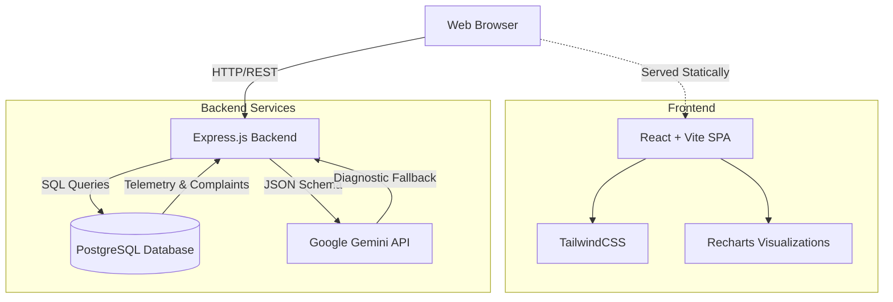

# DigiPlus: Campus Wi-Fi Health Monitor
**Comprehensive Project Documentation & Technical Approach**

## 1. Executive Summary
DigiPlus is a full-stack, AI-powered infrastructure monitoring dashboard designed specifically for university and enterprise campuses. It processes raw 24-hour telemetry data (speed, latency, packet loss, and device disconnects) alongside user complaints to generate a real-time, strict `0-100` health score for every router on campus. By proactively identifying failing hardware before complete network outages occur, DigiPlus allows IT teams to shift from reactive troubleshooting to proactive maintenance.

---

## 2. Key Features

### 2.1. 24-Hour Rolling Health Engine
Instead of relying on instantaneous snapshots, DigiPlus calculates health using a weighted moving average over the last 24 hours. The algorithm heavily penalizes packet loss and frequent disconnects (which disrupt video calls and online exams) while being more forgiving of minor latency spikes.

### 2.2. Smart Ranking System
The dashboard automatically sorts routers by their health score. The worst-performing routers (often in the "Critical" or "Warning" zones) are pushed to the very top of the live sidebar, allowing IT technicians to immediately see which buildings and rooms require urgent attention.

### 2.3. Visual Telemetry
Every router features an interactive, visual dashboard built with Recharts. It graphs hourly trends for latency and packet loss, instantly highlighting abnormal spikes and network congestion patterns visually.

### 2.4. AI Copilot Diagnostics (Gemini)
Integrated directly into the dashboard is a diagnostic AI Copilot powered by Google Gemini. By analyzing the router's exact metrics and correlating them with human-written complaint tickets, the AI outputs a root cause analysis and recommends exactly one actionable fix (e.g., *Firmware Update*, *Relocate*, *Replace*, or *User Education*).

---

## 3. Technical Architecture & Approach

### System Architecture Diagram

### 3.1. Frontend (React + Vite)
- **Framework:** Built using React and Vite for lightning-fast hot module replacement and optimized production builds.
- **Styling:** TailwindCSS is utilized to create a clean, modern, and accessible "Light Theme" UI, ensuring high contrast and readability for data-dense tables and charts.
- **Components:** Modular component design separates the Sidebar (rankings) from the Main Dashboard (telemetry and AI insights).
- **Data Visualization:** `recharts` is used to render responsive, SVG-based line charts for the telemetry data.

### 3.2. Backend (Node.js + Express)
- **API Layer:** An Express.js server provides RESTful endpoints (`/api/routers`, `/api/rankings`, `/api/copilot/ask`) for the frontend to consume.
- **AI Integration:** Uses the official `@google/genai` SDK. To ensure reliable frontend rendering, the backend forces the Gemini API to respond in a strict JSON schema. 
- **Graceful Degradation:** If the Gemini API hits a rate limit or quota exhaustion (429 error), the backend automatically falls back to a deterministic, rule-based diagnostic engine so the UI never crashes.

### 3.3. Database (PostgreSQL)
- **Relational Structure:** A normalized PostgreSQL database ensures data integrity. 
  - `routers`: Stores hardware info (Model, Firmware, Location).
  - `metrics`: Stores hourly telemetry (Speed, Latency, Signal).
  - `complaints`: Stores human-written IT tickets.
- **Data Seeding:** A robust `seed.js` script was engineered to parse massive CSV files (`routers.csv`, `metrics.csv`, `COMPLA_1.CSV`) and safely bulk-insert them into the PostgreSQL tables.

### 3.4. Deployment & DevOps (Docker)
- **Multi-Stage Build:** The entire application is containerized using a single, highly optimized `Dockerfile`.
  - *Stage 1:* Installs Vite and builds the React frontend into static HTML/JS/CSS files.
  - *Stage 2:* Copies the Node.js backend, installs production dependencies, and copies the React build into the backend's `public/` directory.
- **Single Container Execution:** The Express backend is configured with a catch-all route (`app.get("*")`) to statically serve the React SPA alongside the API. This allows the entire full-stack application to be deployed effortlessly on platforms like Render using a single cloud container.
